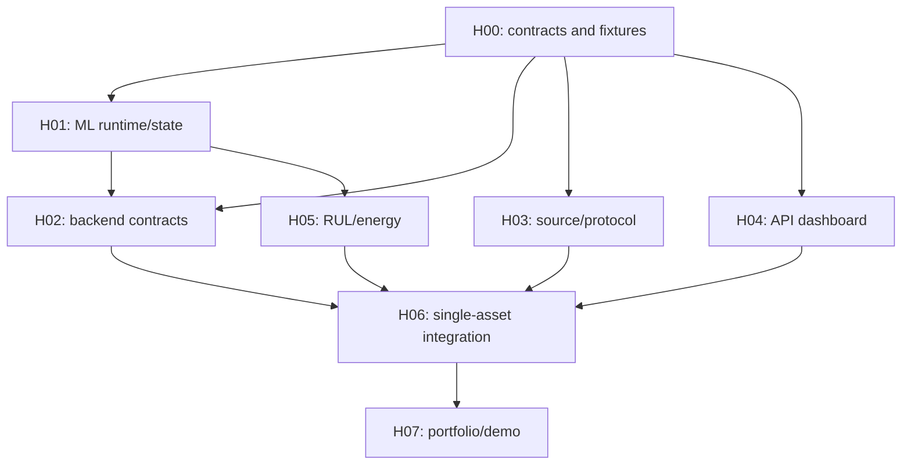

# Part 2 — Dependency-ordered implementation roadmap

Planning date: 9 October 2026. Baseline branch `develop`, HEAD `71c1b27200b91f3933c52692748935f4a62d63e8`. Compared with Part 1 `c7d12df6feeb7bb076bc9fac6151e3dd10c2670e`, the only intervening commit adds the eight audit documents, byte-identical to the saved copies. Application source has not changed. The original planning run began with a clean workspace; teammates' private work remains inaccessible. No application features were implemented and no application tests were rerun during Part 2. The audit's prior test outcomes remain historical evidence, not new passes.

Recovery check, 9 October 2026: the GitHub branch API and local HEAD both still resolve to that SHA. All 18 Markdown files were recovered locally: seven unchanged Part 1 evidence documents, the updated index, this roadmap, the integration acceptance specification and eight phase prompts. The ten new Part 2 files are untracked and README.md is modified; these planning changes are not present on GitHub. No phase file needs to be recreated. Recovery reviews the roadmap first, then prompts in batches H00/H01, H02/H03, H04/H05 and H06/H07, followed by acceptance/index consistency checks. This is documentation recovery and verification, not execution of the implementation phases.

Narrow checks reconfirm F01 local studio analytics, F02 Compose stub/missing ML install/frontend, F04 metadata filtering and enum mismatch, F09 partial/ambiguous nameplate, F13 ignored history and row cap, F14 timestamp-only duplicate, F18 forecast serialization mismatch. Preserve valid Phase 00–08 algorithms and existing backend lifecycle/validation. Root dataschema's Streamlit owner text and Part 1 README's suggested sequencing are historical; this executable plan keeps React and resolves reliability early. Requirements/evidence remain in [GAP_ANALYSIS.md](GAP_ANALYSIS.md) and [REQUIREMENTS_TRACEABILITY_MATRIX.md](REQUIREMENTS_TRACEABILITY_MATRIX.md).

## Execution and ownership

The smallest coherent execution structure is an interface gate, four component tracks, one analytics extension track, single-asset integration and final scale/demo verification. Eight task files are used because the ML owner has a runtime task and a distinct RUL/energy task; these are not eight mandatory serial waves. No fixed calendar or organizer scoring is invented.

| Gate/wave | Task and exact execution file | Person | Dependency / completion gate |
|---|---|---|---|
| Gate A | H00 [Contracts and golden fixtures](phases/00_CONTRACTS_AND_GOLDEN_FIXTURES.md) | 1 lead, 2/3/4 interface review | First task; no predecessor |
| Wave B | H01 [ML release and transactional state](phases/01_ML_RELEASE_AND_TRANSACTIONAL_STATE.md) | 1 ML | H00; tested candidate/checkpoint boundary |
| Wave B | H02 [Backend assets and ingestion](phases/02_BACKEND_ASSETS_AND_INGESTION.md) | 2 backend | H00 to start; H01 for state adapter completion |
| Wave B | H03 [Simulator, Modbus and replay](phases/03_SIMULATOR_MODBUS_AND_REPLAY.md) | 4 simulator/DevOps | H00 to start; H02 for SQL receipt delivery proof |
| Wave B | H04 [Frontend API monitoring](phases/04_FRONTEND_API_MONITORING.md) | 3 frontend | H00 to start; H02/H06 for real API proof |
| Wave C | H05 [RUL and energy analytics](phases/05_RUL_AND_ENERGY_ANALYTICS.md) | 1 ML | H00 + H01; pure fixture tests can overlap remaining H02–H04 |
| Gate D | H06 [Runtime and single-asset integration](phases/06_RUNTIME_AND_SINGLE_ASSET_INTEGRATION.md) | 2 integration, 4 runtime, 3 UI, 1 ML review | H01–H05 ready; no component-file editing collision |
| Gate E | H07 [Portfolio and judging rehearsal](phases/07_PORTFOLIO_AND_JUDGING_REHEARSAL.md) | 4 lead, all verify | H06 actual full single-asset pass |

The B→C arrow is a **completion** dependency: backend schemas/registry/receipt may start while ML state interface is being built. H03 receipt tests and H04 live tests wait for backend, but their independent code/tests do not. These completion gates create no cycle: backend never waits for simulator or browser to implement its contract. H06 delivers the final integration assertions, not a retroactive requirement for H04's component readiness.

Contract owner Person1 freezes semantics in H00; Person2 owns transport/storage/API; Person3 consumes API without local estimators; Person4 owns source encoding, scheduling and delivery. Root Compose, demo scripts and current runbook edits are reserved to H06/H07. Never assign concurrent agents to the same files; H01 finishes state/orchestrator ownership before H05 extends it, and component owners pause shared-path edits for H06. Agents run one file, report real outcomes, and stop.

## Phase cards

| Phase / exact gaps | Objective, outputs and likely paths | Prerequisites / parallel work and interfaces | Acceptance and definition of done | Risk / fallback |
|---|---|---|---|---|
| H00: prerequisites F04/F05/F06/F07/F09/F13/F14/F19 | Versioned additive contract, schemas, fixed UTC golden traces; `docs/contracts/`, `tests/fixtures/hackathon/` | Lead + all-owner review. No code changes here; API/checkpoint/receipt/provenance ownership frozen | Valid/invalid examples, null/zero/units, staged state and all four consumer shapes agree; fixture validation recorded | Unknown data represented explicitly, never invented. Block incompatible contracts before coding |
| H01: F03/F13/F14/F18 | Recover honest bundle or opt-in demo mode; installable ML; candidate/checkpoint/state/history fixes; `ml/pipeline/`, ML packaging/tests | H00; backend/simulator/UI independent work in parallel. Tested prepare/export/install API to H02, extension area to H05 | Strict missing-artifact failure, distinct demo id, forecast gate retained; rollback/rehydration/duplicates/1h coverage tests pass | Original bundle missing blocks fitted claim; existing coded params permitted only demo-unverified. No blanket retraining |
| H02: F04/F09/F12/F13/F14 | Typed acquisition/nameplate/analytics, migration, receipts/hash conflicts, transaction checkpoint; backend schemas/models/repos/services/API | H00 start, H01 adapter finish. Exposes registry/latest/history/receipts to H03/H04 | Round-trip metadata/nameplate, real SQL migrations, 409 changed duplicate, receipt after commit, rollback/restart no state drift | No PostgreSQL → verification blocked until H06; no invented registry ratings |
| H03: F06/F10/F11/F12/F16 | Incremental coherent generator, canonical replay, pinned pymodbus FC04 server/bridge/spool, multi-asset scheduler; simulator and tests | H00; H02 only for receipt integration. Backend consumes canonical envelope, not raw register/CSV fields | Loopback independent FC04 proof, rated overload, recomputed energy/thermal dt, timestamp replay, broker/restart spool checks | HTTP labelled replay fallback keeps analytics available but does not count as Modbus; stable package API must be tested |
| H04: F01/F08/F19/F16 | Typed API client/polling, real selected asset/history/alerts, RUL/energy views, portfolio/null/stale/source labels; frontend | H00 fixtures for component work; H02 API proof; H05 outputs connected H06 | Build/lint + focused render/race/null tests; backend-to-DOM proof in H06; no fabricated claims/local monitoring analytics | Fixtures test-only; outage visibly stale/unavailable, never hidden mock fallback |
| H05: F05/F07 | Synthetic first-passage RUL + real-input insufficiency; time/counter/coverage energy, eligible loss and advisory comparison; `ml/rul/`, `ml/energy/`, tests | H01 + H00; overlap remaining component work. H06 persists RUL and exposes energy; existing HI/risk untouched | 80h synthetic oracle, zero/missing/horizon/state cases; 20kWh/5kWh/reset/gap/unit fixtures and same-service conservation comparison; no empirical claims | Real thermal-life RUL blocked by unverified hotspot/prior exposure/life budget; numeric thermal estimate optional evidence-gated |
| H06: F02/F15 and delivery F01/F04/F05/F06/F07/F09–F14/F20 | Actual ML images/runtime, services/config/scripts, RUL/energy routes, browser and database/protocol proof; root Compose/Docker + coordinated backend/UI | H01–H05. All owners join; root integration lead controls edits | Clean start, migrations and real SQL tests, register→broker→SQL→analytics→API→DOM trace, real RUL/energy views; detailed suite linked below | Docker unavailable→native checks recorded but clean-start gate pending. Demo-unverified bundle acceptable if labelled; stub is not primary |
| H07: F16/F17/F20, final F15 | 25 simulated assets, outage/isolation/restart soak and repeatable judging/runbook evidence; execution docs and diagnosed small fixes only | H06. All owners observe; no new algorithm initiative | Proposed 25×5s×30min p95<10s target measured, independent asset faults, fallback, fresh-teammate rehearsal, truthful checklist | Capacity failure disclosed with actual count/cadence and complete single-asset path; live path stays disabled pending authorization |

Each linked prompt contains relevant files, exact scope/outputs, missing-data behavior, focused commands, regression expectations and completion report. Use those detailed instructions as the implementation specification; the cards are scheduling summaries. Definitions of done are evidence gates, never simply file creation.

## P0/P1 closure ledger

Every important gap has one producing task and a final integration verifier. No P0/P1 is deferred solely because equipment/data are unavailable; physical claims have honest insufficient-data modes instead.

| Gap | Severity | Producing / closing task(s) | Final verification |
|---|---|---|---|
| F01 | P0 | H04, H06 | Real API→DOM selected asset/timestamp |
| F02 | P0 | H01 packaging, H06 runtime | Fresh setup actual Python ML |
| F03 | P0 | H01 | Verified original hashes OR explicit demo-unverified gate; fitted evidence remains blocked if missing |
| F04 | P0 | H00, H02 | Metadata/schema/ORM/API round-trip and late policy |
| F05 | P0 | H05, H06/H04 display | Synthetic first-passage plus operational null/prerequisites |
| F06 | P0 | H03, H06 | Independent FC04 trace plus MQTT/SQL |
| F07 | P1 | H05, H06/H04 display | Known-input units/time/reset/coverage and advisory conservation |
| F08 | P1 | H04 | Unsupported claims removed, null risk respected |
| F09 | P1 | H00, H01 config eligibility, H02 | Asset CRUD/provenance/units and absent-value gates |
| F10 | P1 | H03 | Rated overload and coupled P/E/dt evidence |
| F11 | P1 | H03 | Canonical replay alignment/power/WTI/time semantics |
| F12 | P1 | H02, H03 | Bounded durable spool, commit receipts/outage and honest counts |
| F13 | P1 | H01, H02 | Hour coverage, state transaction/restart/rollback |
| F14 | P1 | H01, H02 | Same-key changed trip conflict, exact retry idempotent |
| F15 | P1 | H06, H07 | Actual DB/broker/browser integration and clean start |
| F16 | P2 | H03, H04, H07 | 25 isolated simulated streams, capacity measured |
| F17 | P2 | H02 source labels, H06/H07 isolation | Optional real equipment disabled/read-only authorized prerequisites |
| F18 | P2 | H01 | Writer/loader round-trip; no automatic forecast release |
| F19 | P2 | H00, H04 | API types/null/units/weights/current interpretation |
| F20 | P2 | H06, H07 | Current commands corrected; historic ML plans retained |

Potential remaining deferrals: trained empirical RUL, standards-certified thermal insulation-life, measured losses/savings, live substation/25-live-device connections, THD without acquired fields, empirical forecast release, optional downloadable reports and push streaming (polling is sufficient). None can be asserted from current evidence; they do not block the labelled local prototype. Preserve fault-risk null gate as a truthful validated limitation, not a model-retraining task.

## First assignment and final gate

Run H00 first. Then give H01 to Person1, H02 to Person2, H03 to Person4, H04 to Person3. Person1 moves to H05 after H01; others finish their component gates. H06 integrates, H07 rehearses. Do not run filenames as eight sequential tasks, and do not start integration with undocumented contract drift.

Final evidence follows [INTEGRATION_AND_DEMO_ACCEPTANCE.md](INTEGRATION_AND_DEMO_ACCEPTANCE.md). Planning verification confirms paths, coverage, stops and DAG only; application completion is assessed by later execution reports. Missing original artifacts, raw historical units/timezones, nameplate/operator data, verified thermal/loss/lifetime parameters and live permissions remain external dependencies. Current local Docker/DB availability must be rechecked by implementing agents.
