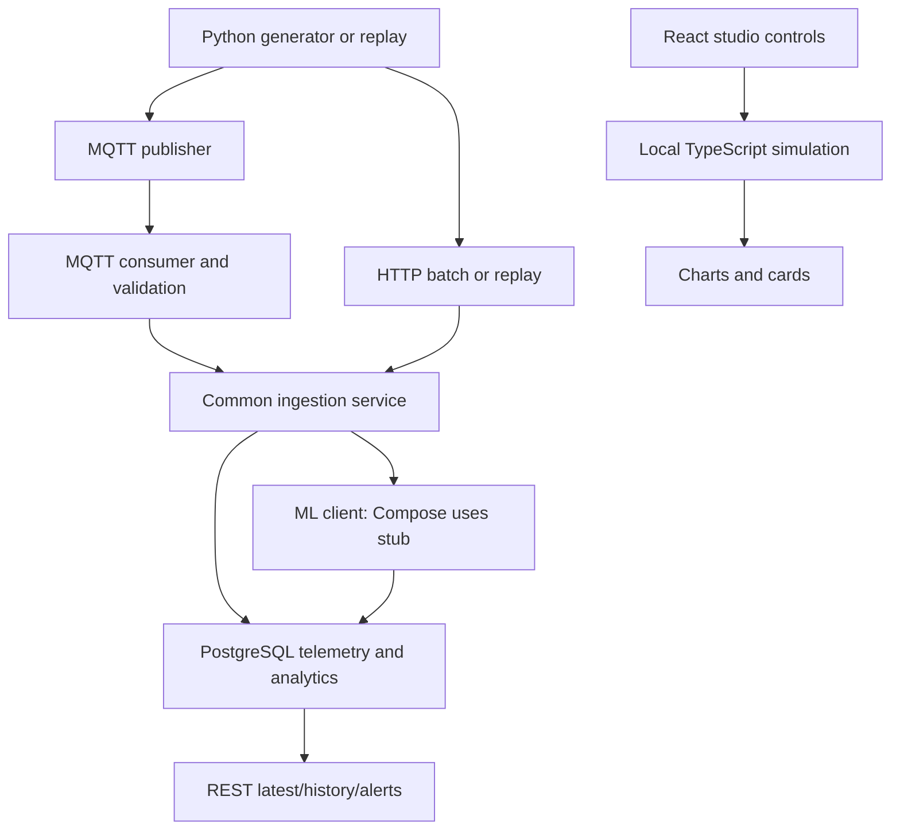

# Repository audit

## Scope and evidence rules

Pinned `develop`: `c7d12df6feeb7bb076bc9fac6151e3dd10c2670e`. GitHub branch API and local `git rev-parse HEAD` agreed. GitHub default is `main` per supplied context. Fresh clone working tree initially clean; this does not reveal team laptops, unpushed commits, deployments or local data/ secrets/configuration. Full problem PDF (4 pages), all workbook cells/formulas/cached values (one sheet), five images and both uploaded contracts were inspected locally. Contract text matches repository after line-ending normalization (byte difference is newline format). No attachments were changed.

Inventory includes root/workstream READMEs, contracts, Dockerfiles/Compose/configuration, backend APIs/schemas/ORM/repositories/services/MQTT/migrations/tests, simulator generation/scenarios/replay/streaming/CLI/schema, ML adapter/features/thermal/anomaly/HI/proxy/maintenance/evaluation/pipeline/tests, `docs/implementation/AUDIT_PLAN.md`, all Phase 00–08 documents, model card/methodology/demo runbook. This is a targeted architectural audit, not a line-by-line proof of every branch or production security review. Embedded README metrics and prior acceptance JSONs are documentary claims unless reproduced below.

## Supplied material register

| Material | Observed facts | Limits / classification |
|---|---|---|
| DT Problem Statement.pdf pp.1–4 | Operational-data simulation, electrical/thermal monitoring, HI, abnormalities, maintenance and interactive dashboard; architecture includes RUL, reporting/trends/downloadable summaries. Prototype may use simulated data and allow future sensors. | Official supplied challenge document. RUL additionally confirmed mandatory by user. No scoring weights or compulsory live telemetry stated. |
| Draft Data for Condition Monitoring.xlsx | One visible `Sheet1`, 35 rows × 8 columns, no hidden sheets/comments. Contains measurement and protection test comparisons, not a time series. | Exact supplied filename lacks `(2)`; no second workbook/version was accessible. |
| WhatsApp Image 2026-10-08 at 9.02.13 PM.jpeg | Organizer email screenshot recommends field semantics/units and rated kVA, HV/LV, current, frequency, vector group, impedance, cooling class and rise limits. | Supplied screenshot of clarification; email provenance not independently authenticated. “Preferably” is recommendation wording. |
| WhatsApp Image 2026-10-08 at 9.54.36 PM.jpeg | Recommends timestamps/electrical/thermal/alarm-trip labels. Scenarios include overload, voltage, heating, THD, unbalance. Historical replay/simulation acceptable if time behavior and alarm/trip are faithful. | Precision/recall/F1/false alarms/lead time are suggested metrics, not invented weighting. Live only where available. |
| WhatsApp Image 2026-10-09 at 11.43.20 AM.jpeg | Reference architecture: sensors → IoT/SCADA gateway (Modbus/MQTT) → acquisition → electrical/thermal/ageing/ML → HI/anomaly/fault/RUL/maintenance/dashboard. | Reference design; not proof every pictured sensor exists or a mandated parts list. |
| WhatsApp Image 2026-10-09 at 11.39.42 AM.jpeg and 11.32.58 AM.jpeg | Dashboard visual references show portfolio/transformer/chart/status layouts. | Low-resolution labels unreadable in places; no numbers extracted as engineering evidence. |
| dataschema.md, mlcontract.md | Canonical schema v1.0.0, nullable measurement policy, source adapter boundary, proxy fault caution, advisory maintenance and versioning. | Root contracts have no RUL contract; implementation adds metadata not accepted by backend. |

Earlier image-not-found messages were transient: all five files were present and visually inspected during this audit.

## Workbook: actual fields, units and coverage

Rows 3–10: headers `Rated`, `Software`, `DIFF`, `%`, `Is it <= 1%?`; channel `CHANNEL-A`; fields `IR (A)`, `IY (A)`, `IB (A)`, `VR (V)`, `VY (V)`, `VB (V)`.

| Field / cell row | Rated/reference | Software | Explicit unit |
|---|---:|---:|---|
| IR / 4 | 49.79 | 49.92 | A |
| IY / 5 | 49.78 | 49.91 | A |
| IB / 6 | 49.80 | 49.89 | A |
| VR / 8 | 259.05 | 259.15 | V |
| VY / 9 | 259.91 | 259.98 | V |
| VB / 10 | 264.40 | 264.52 | V |

Differences are Rated−Software, percentage = difference×100/ Rated, pass = absolute percentage≤1. Cached pass is Yes for all six. This demonstrates the sheet's comparison convention, not performance of repository software.

Current trip section rows 12–19: heading mentions time in seconds, but no time observations exist. Current in Amps is explicit. Rows R/Y/B compare 50.14/50.13/49.81 to software 50.33/50.34/49.98. Note says tripped at set current 50 A. These are test observations/settings, not verified nameplate current or safety recommendations.

Temperature-trip rows 21–25: `Setting`, `Rated`, `Software`, `Difference`; three settings 60, Rated 59.9/59.45/59.5, Software 60.25/60/59.75. Temperature unit and sensor location are not given by headers, comments or cell formats. Do not silently assign °C or thermal limits from these numbers.

Oil rows 28–29: `Oil Leakage`, `Rated level`, `Check of minimum level`, `Volume of oil` and sensor-needed note. No numeric level/volume/threshold/unit exists. Communication rows 32–33: `Communication`, `GPRS and Master Number`, status-intimation note; no actual device number or protocol configuration. Row 35 has AI-decision wording only.

No timestamps, transformer id/nameplate, load history, ambient readings, power/energy/PF history, actual fault classes, commissioning age, failure/end-of-life labels or degradation trajectories. Sparse blank layout cells are not sensor-missing counts. There is no empirical RUL-training or forecasting dataset in this workbook.

## Current architecture and actual end-to-end path

The REST-to-React edge does not exist. Actual ML code is callable separately and via configurable Python client in the local smoke test; it is not packaged/enabled by Compose. There is no Modbus edge. Reporting/downloadable summaries beyond existing read APIs are not established.

### Frontend

`frontend/src/App.tsx` renders a presentation page and studio with anchors/theme state. React hooks manage three static assets and five scenarios; custom canvas/chart/dial/action components give a usable visual base. `data/scadaSimulation.ts` produces heuristic telemetry, scores, categorical diagnosis, fixed confidence and random synthetic history. There is no backend client, network loading/error state, persisted alert lifecycle, operator event subscription, measured power/energy view or RUL display. WARM-UP/null analytics labels exist in component rendering but current local generator supplies numbers. Source-unit qualification and actual freshness/error behavior are not integrated. Build passes; browser behavior was not tested.

### Backend

FastAPI router under `/api/v1`: telemetry POST and batch, registry GET/POST/PATCH, latest, telemetry/analytics/health history, trends, scenarios, alerts read/lifecycle writes, maintenance read/status update, simulate replay/status, MQTT status and guarded demo reset. `/health` and readiness are separate health surfaces. See `backend/app/api/v1`, `app/services`, `app/repositories` and existing API docs for full parameter/envelope definitions; do not create a parallel ingestion service.

Canonical Pydantic validation requires aware datetimes, finite numbers, exact binary protection, nullable fields and excludes VL12/VL23/VL31. Common ingest ensures asset, locks asset, inserts telemetry with identity/time uniqueness, loads historical rows, invokes safe ML, persists analytics, runs alert/maintenance hooks and commits. ML failure retains telemetry with unavailable analytics. PostgreSQL ORM includes telemetry/analytics/alerts/maintenance/ingestion runs/registry, three Alembic revisions (initial, maintenance index, alert lifecycle) and per-asset indexes. Their real DB execution was not verified.

MQTT validates JSON/topic identity and canonical records; callback enqueues, one worker invokes common ingestion. Configurable QoS/reconnect/queue metrics exist. Queue is memory-only, with drops surfaced. Replay uses process-local BackgroundTasks, sorts event time and caps wall sleeps at 5 s; event timestamps are preserved. REST trends use buckets with null gaps, not an energy calculation. No SSE/WebSocket route was found; polling is the simplest near-term design. Generic API lacks auth; current Compose binds published ports to localhost. Missing `.env` blocks unprepared Compose startup.

### ML / Digital Twin

| Capability | Code status | Training / validation status in accessible snapshot |
|---|---|---|
| Canonical adapter and causal features | Implemented, unit-tested; WTI conflict handling and excluded voltage fields preserved | Historical source CSVs absent; counts/hashes in older docs unverified |
| Thermal surrogate | Implemented: first-order exponential previous-forcing hold, current-squared driver, signed residual, warm-up and gaps | Coded parameters exist; documented calibration/evaluation artifacts absent. Source-unverified mode, not validated physical hot-spot model |
| Anomaly | Hybrid grouped quantile/rule severities, protection override, elapsed-time persistence/coverage | Coded train-reference thresholds; absent data prevents reproducing fit/alert burden |
| HI | Explainable operating index, partial coverage, cap and trip override | Arithmetic/behavior tests pass; not asset life or probability |
| Forecast | Logistic-regression experiment, future oil-alarm/trip onset, causal allowlist, horizon censoring/purging, release gate | No fitted artifact accessible; documented event scarcity not remeasured; operational risk stays null |
| Maintenance | Deterministic advisory policy, persistence, trip latch, conservative insufficiency | Functional tests pass, site operating/clear policy still requires configuration |
| Unified pipeline | Isolated in-memory state, current-row analysis and batch API | Tests pass for tested cases; restart/history/conflict/transaction gaps F13/F14 remain |
| RUL / ageing | No estimator; unavailable metadata only | No lifetime labels or baseline degradation evidence |
| Energy / efficiency | Fields/features available | No consumption/loss/savings estimator found |
| Release | Manifest parser/tests and documentation exist | Manifest/artifacts absent; 26 release tests error |

Thermal equation in `ml/thermal/thermal_twin.py`: J=(I1²+I2²+I3²)/3, u=b0+bA×ambient+bJ×J, prediction uses previous forcing and exp(−elapsed_hours/τ); current oil observation is scored after prediction. Default τ=0.240 h, warm-up=−τ ln(0.05)≈0.719 h (about 43.1 min), not simply 3 readings over 30 min as ML README suggests. Detector/maintenance persistence is separate (3 qualifying observations over at least 30 min). These are model/configuration choices, not standards temperature limits.

Preserve the current future-onset target and gated null risk. Existing chronological split documentation and exploratory event-era evaluation are sensible controls, but historical metrics such as MAE 1.17 source units are documentary until datasets/artifacts reproduce them. Do not report them as this audit's result.

### Simulator

Seeded numpy generator, timestamped records, configurable interval/id, nine scenario catalogue entries, CSV replay, MQTT/HTTP publishers, generate/inject/stream/demo/seed/reset utilities exist. No Modbus, scheduler for 25 assets, persistent delivery queue or loss/ageing truth trajectory exists. Generated default 500 kVA/415 V/695 A and frontend asset nameplates are fictional/demo values. CLI creates nullable config, then generator substitutes defaults internally; registry configuration is not automatically registered. Source/scenario metadata objects are not fully attached to streaming records. Fault injection is a fixture mechanism, not actual physical failure evidence.

## Contract mismatch summary

See [GAP_ANALYSIS.md](GAP_ANALYSIS.md) for exact locations and tests: metadata discarded (F04), nullable/source-unit and HI/current semantics differ (F19), timestamp policies differ (ML silently assigns UTC to naive timestamps, backend rejects naive timestamps, source adapter preserves unknown time), replay power mapping differs (F11), history argument unused (F13), artifact preprocessing schema differs (F18), confirmed RUL absent from both contracts (F05). Core canonical names and VL12/VL23/VL31 exclusion are sound and should remain.

## Tests actually run

| Command / check | Result | What it does not establish |
|---|---|---|
| `python -m unittest discover -s ml/tests -p 'test_*.py'` from root | 199 tests, 26 errors on missing release manifest; 173 passed | Historical training, artifact integrity and reported model metrics |
| `PYTHONPATH=simulator:. python -m pytest simulator/tests -q` | 19 passed, one Pydantic deprecation warning | Scenario physical consistency, delivery, Modbus, 25 assets |
| `PYTHONPATH=backend:. python -m pytest backend/tests -q` | 532 passed, 187 skipped, 3 environment failures | All PostgreSQL tests and live stack |
| Focused backend recheck after unsetting proxy environment | 28 passed, including the three failed tests | Not a full second run; initial failures were missing SOCKS support, not established code defects |
| `PYTHONPATH=backend:. python -m ml.tests.smoke_e2e` | Completed; HI trip=0/URGENT, unrated loading null, long-gap reset, actual Python adapter parsing | Script primarily prints scenarios; no live broker, DB or browser |
| Frontend install/build | TypeScript/Vite build passed | Visual/network correctness or inference latency |
| Scratch probes through imported modules | F04 metadata dropped; same-time changed trip stale; F10 overload below rating/energy unchanged; F11 replay power null | Probe findings are functional, not empirical accuracy |

No Docker executable and no TEST_DATABASE_URL were supplied. No real devices contacted, no control writes issued. Tests/dependency installs generated only temporary environment/build artifacts; tracked source files remained unchanged. Read APIs, migrations and historical claims need team-machine validation. Audit is a **conditional component-ready, integration-not-ready** verdict, not a production certification.
