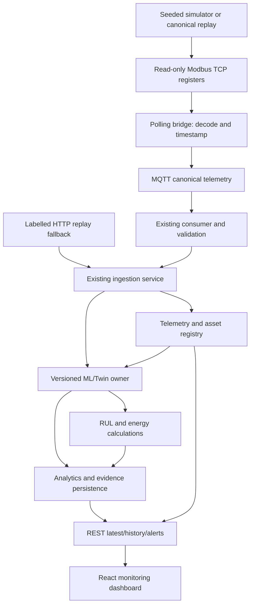

# Recommended target architecture

This is a proposed extension of the pinned repository, not implemented behavior. Keep FastAPI/PostgreSQL, MQTT consumer, canonical adapter, tested ML modules and React cards/charts. Do not restart ML phases or switch frontend stacks to follow an outdated Streamlit preference. Relevant blockers: [GAP_ANALYSIS.md](GAP_ANALYSIS.md) F01–F06, F09, F13/F14.

## Boundaries and flow

The telemetry registry arrow represents explicit configured/historical context, not unrestricted ML SQL access. Acquisition mapping occurs only in source adapters. ML consumes canonical fields plus documented asset config/history. Backend persists versioned results and alert/maintenance effects; frontend displays them. RUL/energy additions are owned analytics modules, never client-derived replacements for HI.

## Preserve these components

| Current component | Proposed use | Narrow addition |
|---|---|---|
| simulator generator/scenarios | Deterministic event source | Time-correct coherent scenarios, incremental multi-asset scheduler, declared fictional configuration |
| ml/adaptors/data_adapter.py | Historical source canonicalization | Expose reusable output to simulator replay; time/provenance adapter agreement |
| backend MQTT consumer | JSON/topic validation and common ingestion | Rich acquisition provenance, durable source retry strategy, actual commit diagnostics |
| backend ingestion/repos/models | Asset locks, dedupe, persistence, lifecycle | Conflict policy; metadata and energy/RUL migration after contract agreement |
| ml.pipeline:analyze | Existing actual inference boundary | Package artifacts/deps; history/checkpoint/restart policy, versioned configuration |
| REST latest/history/trends/alerts/maintenance | UI integration base | Additive status/evidence/result fields, optional portfolio aggregate later |
| React studio/chart/dial/action cards | Monitoring display and separate educational mode | Typed API client, polling, selected asset, source/stale/error states, RUL/energy views |

## Canonical interface

Preserve `transformer_id`, `timestamp`; `phase_voltage_l1/l2/l3`, `current_l1/l2/l3`, `neutral_current`; `oil_temperature`, `winding_temperature`, `ambient_temperature`, `oil_level`; `oil_temp_alarm`, `oil_temp_trip`, `magnetic_oil_gauge_alarm`; `active_power_total`, `apparent_power_total`, `reactive_power_total`, `energy_kwh`; `power_factor_l1/l2/l3`. Do not introduce VL12/VL23/VL31. Protection accepts boolean/integer at input but API normalized form must be documented. WTI public-source status must not become winding °C. No absent measurement becomes zero.

Proposed additive acquisition envelope/metadata needs contract/version agreement before implementation: source_kind (`SIMULATED`, `REPLAYED`, `LIVE`), source_name, gateway_id, register_map_version, units/verification status per field, measurement side, event timestamp, received_at, source_timezone_status, device sequence/snapshot id, quality/conflict flags. A verified source timezone is normalized to UTC; an unknown historic timezone requires explicit staging/approved replay assumption. Do not silently call unknown local timestamps UTC. Simulated timestamps may explicitly be UTC by design.

Proposed analytics metadata needs API/schema/ORM persistence: thermal model mode/unit/readiness, assessed health coverage/component nulls, forecast target/horizon/release status, extended reasons with trigger/value/unit/threshold/reference source/duration, model/config/preprocessing versions. Retain top-level `inference_status` compatibility and declare component-level availability independently. Exact RUL/energy fields are in [RUL_AND_ENERGY_STRATEGY.md](RUL_AND_ENERGY_STRATEGY.md).

## State, ordering and transactions

Use one ML state owner for a given asset; serialize per-asset calls. An in-process single-owner deployment is a practical initial demo assumption, not durable architecture. Registry/SQL locks do not synchronize multiple Python singleton instances across workers. For longer-term scaling, checkpoint versioned state in storage or replay bounded canonical history before resuming.

Choose explicitly: state commit follows successful accepted telemetry/analytics transaction, or deterministic staged state is discarded on rollback. Identical same-key payload is an idempotent retry; changed payload is a conflict to reject/quarantine, with raw evidence and counts. Late event policy must be visible; authorized backfill uses separate replay state and cannot mutate forward state without deliberate reanalysis.

Store sufficient time coverage rather than fixed 60 rows: one hour at 5s cadence needs roughly 720 prior samples, versus 4 at 15min cadence. Bound memory by time and capacity, preserve rate/gap quality, and disclose reduced coverage. Restart/config/model change requires compatible checkpoint or clear reinitialization/warm-up. No stale valid residuals or trip latch silently lost.

## Real-time UI and portfolio

Start with 2–5-second configurable REST polling for registry/selected latest and bounded history. Abort obsolete asset requests; avoid mixing late replies; display timestamp and freshness. A proposed 10-second stale threshold for a 5-second demo stream is a configurable demo choice. For 15-minute historic telemetry, source cadence governs freshness; acquisition wall-clock age and historical event time are different.

Display source kind, asset/nameplate provenance, MQTT/bridge state, last successful observation, model/readiness, null/no-data/error, alerts and recommendations. Gaps remain gaps. Scenario controls ask the simulator to change declared generation context; the UI never invents measured analytics. SSE/WebSocket is optional later; MQTT ingest does not itself make the browser real-time.

For 25 simulated assets, registry drives selection and portfolio state. Each asset owns generator/injector RNG, cumulative energy, thermal/history/latch state, timestamps and configuration. Reuse backend identity/time keys. Publisher ids are unique or one scheduler owns a publisher; report 25 simulated streams and tested rates, not 25 substations connected live.

## Integration acceptance

A stored row, ML output, alert/maintenance record and displayed timestamp must correlate to the same asset/snapshot. Trace healthy → increased rated load with lag → persistent discrepancy → trip → recovery/missing data, then RUL scenario and energy counter reset. Repeat via replay fallback. Existing local smoke passing is useful but does not replace this acquisition-to-browser test.
