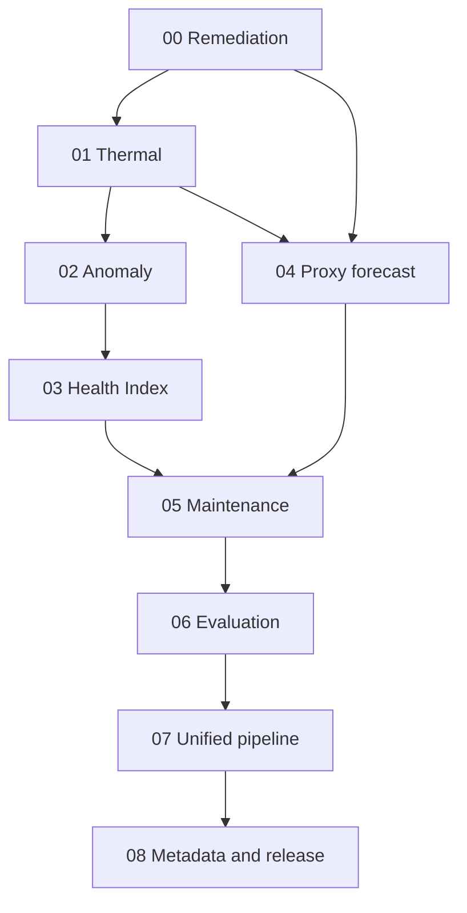

# ML / Digital Twin Implementation Plan

Specification date: 2026-10-08. This package translates the established conversation into implementation instructions; it does not replace the audit or introduce a new methodology.

## 1. Purpose and scope

Implement the ML/Digital Twin layer in the existing Transformer-digital-twin repository. Read this master document and the assigned phase specification before changing repository code. Inspect actual repository paths, contracts and implementation first. The supplied attachments were the audited snapshot; the live repository and ml_README.md were inaccessible during that audit. Do not assume the repository is unchanged.

Scope: prerequisite repair, thermal model, anomaly detection, operating Health Index, experimental proxy forecasting, maintenance, evaluation, unified inference and release. No autonomous electrical switching. No fabricated RUL. No silent canonical-schema or ML-contract changes.

Evidence vocabulary: **VERIFIED FROM STANDARD** (including explicitly identified official explanatory material); **VERIFIED FROM DATA**; **VERIFIED FROM PROJECT DOCUMENT**; **CONFIGURATION REQUIRED**; **DATASET-DERIVED**; **ASSUMPTION / HEURISTIC**; **UNKNOWN / NEEDS ORGANIZER CONFIRMATION**. Use these classifications in configuration/threshold provenance. Model-fitted quantities are model-learned and carry dataset/split provenance; never describe them as standard constants.

## 2. Current ML architecture

Raw sources → adapter → canonical telemetry → validation → causal features → thermal twin → anomaly and fault-model branches → Health Index → maintenance → unified output → API/dashboard.

The fault branch consumes only its approved causal features and out-of-sample thermal features. It does not consume Health Index, maintenance output or alarm-derived anomaly output. Health Index does not require a fault probability. Maintenance can consume a validated probability but must operate when forecasting is unavailable.

Arrows into maintenance from forecasting mean an interface/status dependency, not a requirement for a usable trained forecast. Phase 06 also consumes phases 00–04 directly. Evaluation protocol and leakage rules apply from phase 00; formal results are assembled in phase 06. Phase 07 uses already evaluated module candidates, then runs end-to-end checks and reruns affected evaluation checks. This resolves the apparent evaluation/integration ordering cycle without adding another phase.

## 3. Current implementation state

Existing supplied modules: data_adapter.py, feature_engineering.py and thermal_twin.py, with unit tests. Schema v1.0.0 and development ML contract exist. No anomaly, HI, forecasting or maintenance implementation was supplied. The notebook covers ingestion EDA rather than model validation.

Audited artifact facts, to be reconfirmed against repository inputs:

| Source | Raw rows | Unique timestamps | Extra duplicate rows |
|---|---:|---:|---:|
| CurrentVoltage.csv | 19,352 | 18,915 | 437 |
| Overview.csv | 20,316 | 19,376 | 940 |
| Power.csv | 19,309 | 18,871 | 438 |
| PowerFactor.csv | 19,308 | 18,877 | 431 |
| TotalPower.csv | 19,248 | 18,842 | 406 |

Under the audited aggregation/outer-union rules: 20,024 timestamps, 18,328 complete canonical numeric rows, 27 Power-only timestamps, median cadence 15 minutes, 99 gaps >30 minutes, 57 gaps >60 minutes, maximum gap 48,398 minutes. Union range: 2019-06-25 12:39 through 2020-04-14 00:30; timezone unknown. These counts are reference fingerprints, not immutable requirements if the documented duplicate policy changes.

The attached canonical_telemetry.csv has only two synthetic rows in January 2026 matching an adapter test fixture. Existing tests write to the fixed production output location. Repair artifact isolation before any fitting. Raw WTI is exclusively 0/1; averaging produces seventeen 0.5 values. Exclude WTI from continuous-temperature models.

Observed resolved labels: oil alarm 100 rows/11 observed onsets; trip 47 rows/10 onsets; MOG 2,087 rows/5 onsets. Thermal positives end 2019-09-03 15:00; MOG positives end 2019-08-10 13:45. All 47 trip rows coincide with the 47 OTI >100 rows. These are proxy states, not verified failures. Long events and overlapping windows are not independent samples.

## 4. Implementation dependency graph

| Phase | Depends on | Produces | Consumed by | Blocks | Can be implemented independently | Must be validated before |
|---|---|---|---|---|---|---|
| 00 | Existing repository/schema/contract | Safe adapter, quality boundary, corrected causal features, provenance | 01–08 | Every real-data model fit | Source review and tests only | Any calibration/training |
| 01 | 00 | Stateful calibrated oil baseline, residual/readiness | 02, 04, 06, 07 | Thermal residual consumers | Interfaces/tests before calibration | Residual threshold fitting and fault-feature use |
| 02 | 00, 01 | Group severities, score/flag/reasons | 03, 05, 06, 07 | HI and maintenance anomaly evidence | Rule skeleton on fixtures | Health/integration acceptance |
| 03 | 00, 02 and thermal/loading/oil evidence | HI/components/coverage | 05–07 | Complete maintenance explanations | Arithmetic tests on fixtures | Maintenance acceptance |
| 04 | 00, 01; global evaluation protocol | Onset labels, experimental model or unavailable status | 05–08 | Forecast claims, not other analytics | Target builder/interface on fixtures | Risk may influence maintenance |
| 05 | 00–03, 04 interface/status | Advisory priority/action/reasons | 06–08 | End-to-end decision behavior | Rules on fixtures; no trained risk needed | Integration demo |
| 06 | 00–05 | Time-aware metrics, limitations, release eligibility | 07–08 | Model promotion and probability claims | Evaluation harness can start early | Unified candidate promotion |
| 07 | 00–06 | Stable stateful result/API boundary and smoke validation | 08, backend/dashboard | Release/demo integration | Contract harness on fixtures | Release signoff |
| 08 | 00–07 | Versioned bundle/model card/runbook/release checks | Team and future adapters | Release | Metadata scaffold can start early | Final demo/release |

## 5. Phase-by-phase roadmap

1. [00_PREREQUISITE_REMEDIATION.md](00_PREREQUISITE_REMEDIATION.md): repair artifact writes, WTI handling, validation, phase completeness, time policy, feature semantics and configuration boundary.
2. [01_THERMAL_TWIN_FINALIZATION.md](01_THERMAL_TWIN_FINALIZATION.md): fixed time-unit dynamics, state persistence, gap/warm-up behavior, calibrated empirical mode and future standards-mode prerequisites.
3. [02_ANOMALY_DETECTION.md](02_ANOMALY_DETECTION.md): grouped statistical/engineering evidence, score normalization, flags and explanation.
4. [03_HEALTH_INDEX.md](03_HEALTH_INDEX.md): six components, weights, persistent-condition cap, trip override and partial coverage.
5. [04_FAULT_PREDICTION.md](04_FAULT_PREDICTION.md): next-hour proxy onset, eligibility/censoring, minimal Logistic Regression baseline, unavailable output when unsupported.
6. [05_MAINTENANCE_ENGINE.md](05_MAINTENANCE_ENGINE.md): deterministic advisory priorities, persistence, corroboration and recovery.
7. [06_EVALUATION.md](06_EVALUATION.md): chronological thermal/anomaly/forecast evidence, event accounting, explicit non-estimable metrics and promotion gates.
8. [07_UNIFIED_ML_TWIN_PIPELINE.md](07_UNIFIED_ML_TWIN_PIPELINE.md): stateful orchestration, stable contract, backend/dashboard integration and deterministic replay.
9. [08_MODEL_METADATA_AND_RELEASE.md](08_MODEL_METADATA_AND_RELEASE.md): provenance, model/configuration compatibility, limitations and final release.

Every phase reports changed files, tests, smoke checks, configuration blockers and acceptance status. Do not proceed past a failed upstream gate by inventing data. A capability can legitimately finish as unavailable when its interface, tests and limitation reporting are complete.

## 6. Cross-phase dependencies

- Unit/status verification gates physical interpretation across all phases, not basic source-unit analytics.
- Train/reference boundaries precede parameter fitting. Phase 01 out-of-sample residual generation is required for phases 02 and 04; in-sample fitted residuals cannot masquerade as prospective evidence.
- Phase 02 owns anomaly evidence. Phase 03 reuses it; dashboard must not independently calculate scores.
- Phase 04 eligibility/status must reach phase 05. Unvalidated risk never upgrades maintenance.
- Phase 06 owns metrics/protocol; phase 07 owns delivery/state consistency. End-to-end changes trigger relevant reevaluation, not a new methodology.
- Phase 08 metadata must be populated throughout development, not reconstructed from memory at release.
- A future adapter mapping identical names is insufficient to validate an old model on a new domain.

## 7. Cross-phase invariants and constraints

### Shared variables and units

| Symbol | Meaning | Type/unit |
|---|---|---|
| t, Δt | Observation time, elapsed interval | Timestamp, hours in equations |
| T, A | Observed oil indicator and ambient indicator | Their documented source units; °C only if verified |
| T-hat | Model oil indicator | Same unit as T |
| r | T minus T-hat | Signed oil-temperature/source unit |
| I₁,I₂,I₃; Iᵣ | Same-side RMS phase-line currents; rated line current | A |
| J | Mean squared phase current | A² |
| P; S; Sᵣ | Active power; apparent power; rated apparent power | kW; kVA; kVA |
| K | Current loading ratio | Dimensionless |
| Wⱼ,Cⱼ | Warning and severe reference boundary for signal j | Same unit as signal |
| sⱼ | Family/signal severity | Scalar [0,1] |
| a | anomaly_score | Scalar [0,1], not probability |
| Hⱼ; H | Health component; overall HI | Scalar [0,100] |
| p | Future proxy-onset risk, only when validated | Probability [0,1] |
| τ | Learned/configured thermal time constant | Hours |

Use A exclusively for ambient in equations; use lowercase a for anomaly score. A current amplitude is I, not A. This resolves the shorthand collision in the discussion without changing any formula.

### Locked design choices

| Choice | Established value/status |
|---|---|
| Temperature/oil units | Unverified until source evidence exists |
| Thermal mode now | Empirical first-order oil-signal model with current-squared driver, subject to validation |
| Rolling window | 1 hour; configurable heuristic |
| Continuity/initial gap limit | 30 minutes; configurable heuristic, not proof of constant load |
| Persistence entry/recovery | 3 valid observations spanning at least 30 minutes, no qualifying gap >30 minutes; heuristic |
| Warm-up | Initial-state influence ≤0.05, about 3τ; heuristic tolerance |
| Statistical W/C defaults | Upper Q0.95/Q0.995; direction-reversed lower-tail counterparts; heuristic quantile choices, fitted values train-derived |
| Alert budget starter | ≤1 unexplained episode per 7 adequately observed asset-days; heuristic |
| Forecast target/horizon | New oil alarm OR trip onset in (t,t+1 hour], clear now |
| HI weights T/E/L/O/protection/anomaly | 0.30 / 0.20 / 0.10 / 0.15 / 0.20 / 0.05 |
| Active alarm component | 40 points; heuristic |
| Verified trip | HI 0 and immediate URGENT; operational convention |
| Persistent-condition HI cap | Weighted HI capped at 20 + minimum assessed thermal/electrical/oil/protection score; exclude loading/anomaly |
| Forecast model | Regularized Logistic Regression experiment; no calibrated claim without gates |
| RUL | Unavailable; no HI-to-years conversion |

### Explicit resolutions of apparent conflicts

1. **Contract loading input versus public thermal driver:** retain canonical loading_percent as rated-kVA percentage; leave null without rating. Document empirical thermal mode consuming J rather than inventing a rating. This is an explicit ML-contract clarification, not a raw-schema replacement.
2. **Physical temperature versus source signal:** current T/A model can learn b_A for different source scales. Physical oil rise requires compatible units; top-oil naming additionally requires sensor location.
3. **Thermal CRITICAL versus absolute residual:** negative residual is mismatch; initialization is unavailable, not NORMAL. Physical criticality requires verified limits/protection or documented corroboration.
4. **Optional forecast versus complete pipeline:** null risk with INSUFFICIENT_VALIDATION is the valid current operational default; implementation completion is not evidence of predictive validity.
5. **HI missing loading versus relative load:** required loading health is unavailable without applicable rating/envelope. Historical load-tail evidence may appear in anomaly/context; do not silently present it as rated loading health. An optional relative-mode presentation must be explicit and separately documented.
6. **Alarm HI 40 versus anomaly 1:** both intentionally apply; the 5% anomaly contribution is acknowledged overlap, not independent probabilistic evidence.
7. **HI cap versus noisy signals:** cap applies to assessed persistent condition evidence or known active protection, not an isolated statistical spike. Weighted score can reflect instantaneous severity while maintenance stays WATCH.
8. **Signed PF formula change:** preserve existing feature meaning unless an explicit feature-version change is made after sign verification. Do not silently reinterpret the same name.
9. **Lower-tail quantiles:** “appropriate direction” means W=Q0.05 and C=Q0.005 for a directly scored low-level variable, the mirrored established upper-tail rule. This is a notation clarification, not a new engineering limit.
10. **Proposed extra metadata versus current response:** status, coverage, evidence, thermal readiness and nullable outputs require documented additive contract agreement where not already declared. Do not silently add enum values or change field meanings.

11. **Thermal state versus later detector thresholds:** phase 01 owns model/readiness and physical-state semantics; phase 02 supplies fitted statistical severity/persistence for integrated condition assessment. This is not a cyclic model-fit dependency: phase 01 can return null statistical state until references are available while still producing ready predictions/residuals. No phase invents residual cutoffs to bypass the gate.

## 8. Data and schema dependencies

Preserve canonical identity transformer_id/timestamp, phase_voltage_l1/l2/l3, current_l1/l2/l3, neutral_current, oil_temperature, winding_temperature, ambient_temperature, oil_level, oil_temp_alarm, oil_temp_trip, magnetic_oil_gauge_alarm, active_power_total, apparent_power_total, reactive_power_total, energy_kwh and power_factor_l1/l2/l3.

VL12, VL23 and VL31 remain excluded from canonical storage, API, model features and dashboard. Raw Kaggle names stay inside source ingestion/diagnostics. Optional field adoption requires explicit schema/feature extension. WTI remains unverified binary/status and is not a continuous thermal input.

Asset configuration: rated_power_kva, rated_voltage_hv/lv with explicit V units, rated_current_a plus side, phase count, vector group, CT/PT ratios, cooling_class, oil_type, insulation type, loss/test parameters, sensor location/resolution, protection settings, source/timezone, provenance/effective dates. Values are CONFIGURATION REQUIRED; none is inferred from dataset maxima or the draft commissioning sheet.

## 9. ML contract dependencies

Keep thermal_model_temperature, thermal_residual, thermal_state; anomaly_score/anomaly_flag/reason_codes; health_index/health_components/health_reason_codes; fault_risk/predicted_fault/prediction_confidence; maintenance_priority/maintenance_recommendation. Priorities remain NORMAL, WATCH, PLAN, URGENT.

Existing contract examples are illustrative, not calibration evidence. Thermal states NORMAL/ELEVATED/CRITICAL apply only when assessment is supported. Use null plus explicit inference status for initialization/insufficiency rather than inventing a thermal enum. INSUFFICIENT_DATA is established; INSUFFICIENT_VALIDATION is the proposed forecast status and must be documented in the contract. Define readiness/coverage/reason evidence as versioned metadata without altering raw telemetry.

loading_percent = 100 S/Sᵣ (%); apparent_power_utilization = S/Sᵣ (dimensionless). Unknown rating → both null and RATING_UNAVAILABLE. Prediction confidence, if exposed after calibration, means max(p,1−p), not reliability.

## 10. Standards and engineering dependencies

Carry forward the audit's qualified evidence, not a new compliance claim:

- IS 2026 Parts 1–5: general/rating, temperature rise, dielectric/clearance, terminal/tapping/connection and short-circuit test context respectively. Part 4 is not interchangeable with IEC part 4 by number alone.
- IS 2026 Part 7:2009 adopts IEC 60076-7:2005; distinguish it from IEC 60076-7:2018 mineral-oil guidance. IEC withdrawal of its 2005 edition does not automatically withdraw the Indian adoption.
- IS 6600:1972 was listed withdrawn: historical use only. Do not assert an unverified formal supersession relationship.
- IS 3639 accessory semantics and IS 10028 Parts 1–3 selection/installation/maintenance inform context, not invented universal alarm settings or inspection intervals.
- Check IS 1180 applicability. Official BIS explanatory material lists three-phase mineral-oil top-oil/average-winding rise 35/40 K up to 200 kVA and 40/45 K above 200 through 2,500 kVA. These are test-rise references, not absolute alarms and not hot-spot limits. Applicable amendments/asset specification require confirmation.
- CPRI test reports are asset-specific evidence; no universal “CPRI ML thresholds” were established.
- Full clause-level standard review was not completed. Do not claim certification/compliance from this package.

Source references retained from the audit:

- [BIS transformer explanatory material](https://www.bis.gov.in/wp-content/uploads/2022/04/BIS-Presentation-Transformers-and-Rotating-Machinery.pdf)
- [IEC 60076-7:2018 catalogue](https://webstore.iec.ch/en/publication/34351)
- [IEC 60076-7:2005 lifecycle](https://webstore.iec.ch/en/publication/605)
- [IS 6600 catalogue listing](https://standardsbis.bsbedge.com/BIS_SearchStandard.aspx?Standard_Number=IS+6600&id=0)
- [CPRI IS 1180 testing](https://cpri.res.in/en/content/distribution-transformers-11802014)
- [Oil-temperature model research](https://www.lias-lab.fr/~eriketien/Files/Other/Improving%20thermal%20model%20for%20oil%20temperature%20estimation%20in%20power.pdf)

## 11. Data-quality requirements

Validate finite values, exact Boolean domains, populated identity, unique asset/time keys, correct time basis, complete phase inputs, sensor plausibility and measurement freshness. Unknown is not zero, clear, healthy or negative label. Preserve raw data and conflict provenance. Resolve duplicate conflicts deliberately; counter “last” needs trusted sequence metadata. No blind clipping, backward-fill, nearest-future joins or long-gap interpolation.

Emit required row/missing/duplicate/gap/range/parse/provenance statistics. Preserve short-term and frozen-reference oil indicators separately. Return rolling count/duration/readiness metadata. No universal sensor bounds, minimum current, alarm-setting values or counter-reset constants were established; mark CONFIGURATION REQUIRED.

## 12. Leakage-prevention requirements

Split before fitting. Fit imputation/scaling/quantiles/thermal parameters on training only. Target future onset, not current alarm detection. Exclude current protection fields, time-since-event, WTI, HI, maintenance, alarm-derived anomaly, absolute timestamp/row number and cumulative energy from the initial fault vector. Generate downstream training residuals with chronological out-of-fold thermal predictions. Purge label horizons crossing split boundaries. Past observation history may cross into validation/test; future labels and parameter fitting may not. No temporal SMOTE; group event windows and respect data availability times.

## 13. Evaluation strategy

Primary fixed boundaries on original union timeline: train before 2019-11-23 11:45; validation from that time to before 2020-02-13 11:15; test thereafter. All positive proxy events precede validation: recall/positive ranking are not estimable there. Later partitions assess thermal/generalization and false-alert behavior, not positive forecast success.

Exploratory event-era split: train before 2019-08-01; validation Aug 1–15; test Aug 16–Sep 3 inclusive; later negative surveillance from Sep 4. This was selected after label inspection and is explicitly exploratory. Validation has one observed thermal episode; calibrated probability claims are not supported merely by completing this experiment.

Report thermal MAE/RMSE/bias/tail error by operating/gap regime; anomaly false episodes per observed asset-day and persistence; forecast confusion matrix, precision/recall/F1, PR-AUC or named AP, event recall, lead time, missed-event analysis, and calibration when supportable. Primary maintenance-use criterion: event recall at constrained false-alert burden with useful lead time. Separate synthetic demonstration from empirical validation.

## 14. Model/versioning requirements

Store schema_version, feature_version, model_version, preprocessing_version, training_dataset_version, training_date, target_definition, feature_names/order and evaluation_metrics. Also store data hashes, splits, horizon, calibration status, units, threshold provenance, configuration version/effective dates, standards basis, thermal constraints, state compatibility, event counts and scenario provenance. Semantic changes cannot reuse an old feature/model meaning silently.

## 15. Demo/integration requirements

Backend consumes canonical inputs and stable analytics, not private dataframes/source names. Dashboard displays supplied scores, nulls, units, readiness, coverage, signed residual, reasons and action. Plot data gaps. Label historical replay/simulation explicitly. Demo: healthy → high load with lagged temperature → persistent model deviation → validated or clearly experimental proxy-risk view → evidence explanation → advisory action. Do not validate simulator and detector using the same exact equation as independent evidence.

## 16. RUL status and dependency

Challenge wording is ambiguous: RUL appears in overview/possible architecture, not an unequivocal numeric deliverable. Organizer confirmation remains required. Current RUL unavailable. No HI-to-years conversion, oil-temperature substitution for hot spot, or fabricated life baseline.

Future ageing requires verified hot spot θₕ (°C), insulation system, applicable standard law, history and reference-life basis. Historical research expressions, retained only as deferred methodology:

$$
V_{age}=2^{(\theta_h-98)/6}
$$

for the specified non-upgraded-paper treatment, or

$$
V_{age}=\exp\left(\frac{15000}{110+273}-\frac{15000}{\theta_h+273}\right)
$$

for the specified thermally upgraded-paper treatment. V_age is dimensionless relative ageing rate; constants belong to the historical law and are not dataset parameters. Confirm selected edition/insulation applicability before implementing. Neither law is enabled now.

$$
L_{eq}\approx\sum_k V_{age,k}\,\Delta t_k
$$

L_eq is equivalent ageing hours when Δt is hours, not automatically percentage loss of life or RUL. Existing consumed life, asset condition and future duty are additionally required.

## 17. Known limitations

Unknown: OTI/ATI units and sensor location; WTI semantics; OLI unit/direction; contact polarity/latching and simulation status; OTI jumps near 250; source asset identity; nameplate/CT/PT/cooling/liquid/insulation; timestamp timezone/interval semantics; actual CPRI reports; RUL obligation. Missing rated parameters block physical loading/standards mode, not the null-safe public baseline. Unknown protection meaning blocks verified protection overrides for a real asset; synthetic demo contacts must be explicitly configured.

No minimum independent-event count, minimum-current gate, sensor plausibility bounds, positive-model cutoff, hold age shorter than the continuity cap, or operator emergency envelope was established. Do not fill these with guessed numbers. Phase-specific gates can remain blocked while interface/tests are completed honestly.

## 18. Final ML completion criteria

- Artifact isolation and regenerated source-provenanced canonical data pass tests.
- Features are causal, unit-qualified, gap-aware and phase-complete.
- Thermal state is persistent; first-order math and segment behavior pass analytical/batch-stream tests; calibration limitations recorded.
- Anomaly score/flag/reasons are directional, reproducible and coverage-aware.
- HI arithmetic, coverage, cap and trip override pass established examples.
- Forecast target/evaluation is implemented; unsupported risk is null and does not drive maintenance.
- Maintenance is deterministic, persistent, advisory and protection-aware.
- Metrics reflect chronological/event limitations with no future fitting.
- Unified output matches approved contract and handles retries/restarts/nulls.
- Versioned bundle, methodology/model card and demo runbook are complete.
- No unsupported physical, calibration, failure, standards-compliance or RUL claims remain.

## 19. Final release checklist

- [ ] All nine phase acceptance reports complete or explicitly capability-limited.
- [ ] Production artifacts cannot be overwritten by tests.
- [ ] Source fingerprints and configuration provenance recorded.
- [ ] Schema/feature/contract changes explicitly reviewed and versioned.
- [ ] Excluded fields absent; WTI not used as temperature.
- [ ] Unknown units/ratings remain unknown in API and UI.
- [ ] Model/threshold fitting split boundaries verified.
- [ ] Residual training features are out of sample where required.
- [ ] Single-class evaluation reported honestly.
- [ ] Forecast calibration/release gate enforced.
- [ ] HI and maintenance scenario tests pass.
- [ ] Batch/stream/replay/restart behavior validated.
- [ ] Backend/dashboard null and explanation smoke tests pass.
- [ ] Synthetic versus historical evidence separated.
- [ ] No fabricated RUL or automatic switching.
- [ ] Model/configuration/state compatibility and rollback recorded.
- [ ] Final demo uses declared versions and documented limitations.
